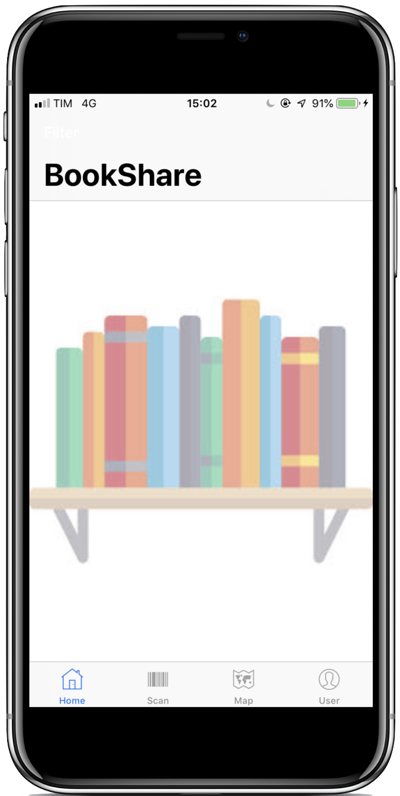
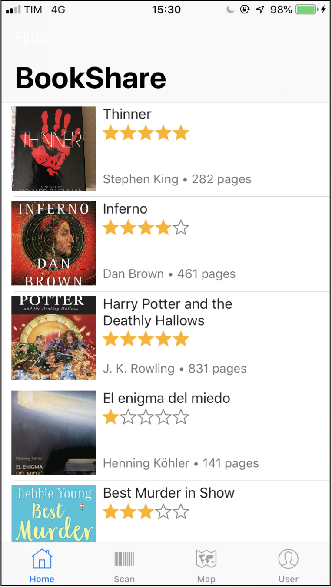
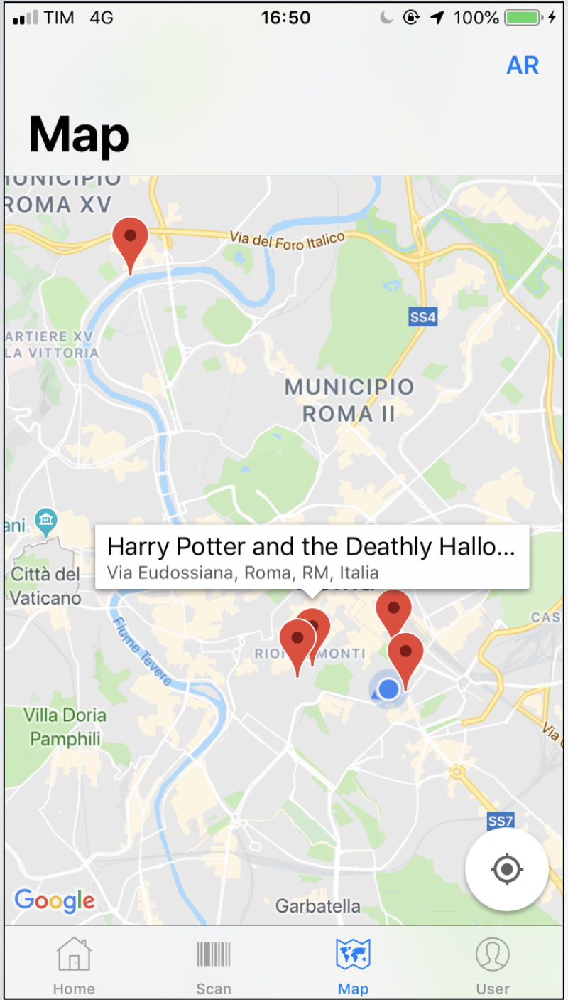

# BookShare

### BookShare is born to let people sell and buy books in a fast and easy way. 

   
  
  
  

When the user starts the app he is prompted to **register**, inserting username e password. Once the account is created on **Firebase**, the access is granted.

Every user can sell a book, by opening the **iPhone Camera**, with the possibility to use flash, and then scanning the barcode of the book.

Book details show up in the details controller, that allows the user to perform multiple actions, like adding a picture, inserting selling location thanks to **Google Places API**, send an email to the seller, purchase or get directions for that book.

Once books are added by the users, going back to the Home page there will be a list of the available books that can be bought 

In the Map controller the user can see a 2D map of the available books, and by going to the AR button, he can see using **Augmented Reality t**he position of the books in space.